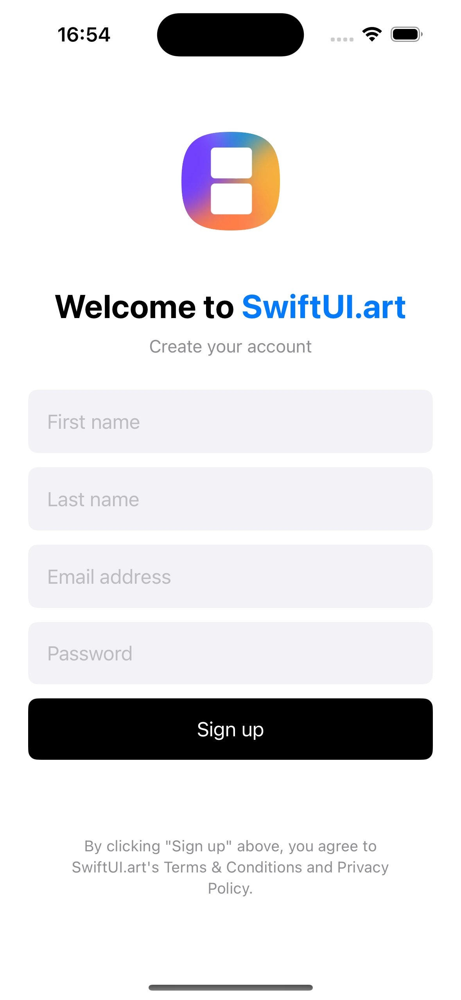
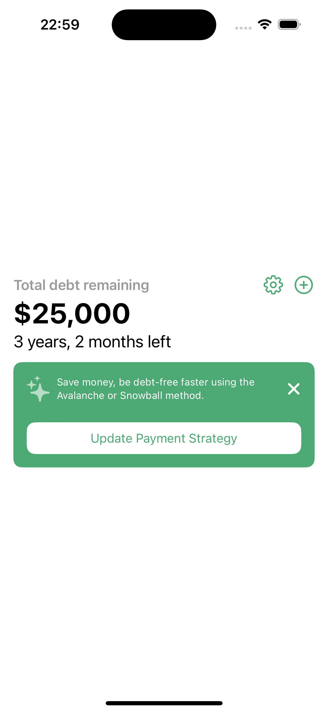

# SwiftUI.art Public Components

Welcome to the SwiftUI.art public repository! Here, you'll find a collection of free SwiftUI design components that you can use for both commercial and non-commercial purposes. Our goal is to provide high-quality, ready-to-use SwiftUI components to help you build beautiful and functional iOS apps faster.

## About SwiftUI.art

At SwiftUI.art, we're dedicated to creating the best SwiftUI design components to save you time and effort. By sharing some of our components here, we hope to give you a taste of what our premium service offers. If you like what you see, consider checking out [SwiftUI.art](https://swiftui.art) for full access to our entire collection, including future updates and new components.

## Available Components

We will continuously update this repository with new components. Here's a checklist of the types of components you can expect to find:

- [x] Login-Screen
- [x] Sign-Up-Screen
- [ ] Forgot-Password
- [ ] Verification-Code
- [ ] Permission-Screens
- [ ] Form-Screens
- [ ] Radio-Groups
- [ ] Input-Groups
- [ ] Search-Screens
- [ ] Detail-Screens
- [ ] Landing-Page
- [ ] Home-Screens
- [ ] Chat-Screens
- [ ] Card-Lists
- [ ] Stacked-Lists
- [ ] Horizontal-Lists
- [ ] Gallery-Lists
- [ ] Avatars
- [ ] Buttons
- [ ] Counters
- [ ] Button-Groups
- [ ] Page-Headers
- [ ] Profile-Cards
- [ ] Action-Sheets
- [ ] Paywalls

## Screenshots

  
  

## Stay Connected

For the latest updates and new component releases, follow us on Twitter and join our community forum.

## License

This project is licensed under the MIT License. See the LICENSE file for details.

## Contact

If you have any questions or feedback, feel free to reach out to us at hello@swiftui.art.
